# GUIDE D'UTILISATION - DEMONSTRATION PEDAGOGIQUE DES THREADS

## TABLE DES MATIERES

1. [Architecture globale](#architecture-globale)
2. [MainApp.java - Application principale](#mainappjava)
3. [Lecon 1 : SimpleThreadDemo.java](#lecon-1--simplethreaddemojava)
4. [Lecon 2 : MultiThreadDemo.java](#lecon-2--multithreaddemojava)
5. [Lecon 3 : SyncProblemDemo.java](#lecon-3--syncproblemdemojava)
6. [Lecon 4 : BankAccountDemo.java](#lecon-4--bankaccountdemojava)
7. [Demo : CircularProgressDemo.java](#demo--circularprogressdemojava)
8. [Demo : ClockDemo.java](#demo--clockdemojava)
9. [Demo : VerticalProgressDemo.java](#demo--verticalprogressdemojava)
10. [Demo : HorizontalProgressDemo.java](#demo--horizontalprogressdemojava)

---

## ARCHITECTURE GLOBALE

### Vue d'ensemble du projet

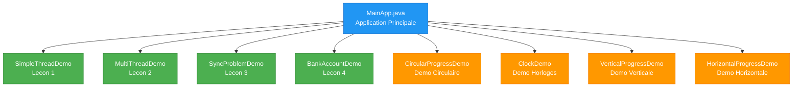
```mermaid
graph TB
    Main[MainApp.java<br/>Application Principale]
    
    Main --> L1[SimpleThreadDemo<br/>Lecon 1]
    Main --> L2[MultiThreadDemo<br/>Lecon 2]
    Main --> L3[SyncProblemDemo<br/>Lecon 3]
    Main --> L4[BankAccountDemo<br/>Lecon 4]
    Main --> D1[CircularProgressDemo<br/>Demo Circulaire]
    Main --> D2[ClockDemo<br/>Demo Horloges]
    Main --> D3[VerticalProgressDemo<br/>Demo Verticale]
    Main --> D4[HorizontalProgressDemo<br/>Demo Horizontale]
    
    style Main fill:#2196F3,stroke:#1976D2,color:#fff
    style L1 fill:#4CAF50,stroke:#388E3C,color:#fff
    style L2 fill:#4CAF50,stroke:#388E3C,color:#fff
    style L3 fill:#4CAF50,stroke:#388E3C,color:#fff
    style L4 fill:#4CAF50,stroke:#388E3C,color:#fff
    style D1 fill:#FF9800,stroke:#F57C00,color:#fff
    style D2 fill:#FF9800,stroke:#F57C00,color:#fff
    style D3 fill:#FF9800,stroke:#F57C00,color:#fff
    style D4 fill:#FF9800,stroke:#F57C00,color:#fff
```

### Organisation des fichiers

```
threadsdemo1/
├── pom.xml                              (Configuration Maven)
├── README.md                            (Documentation generale)
├── documentation/
│   └── GUIDE_UTILISATION.md            (Ce guide)
└── src/main/java/com/threadsdemo/
    ├── MainApp.java                     (Point d'entree de l'application)
    ├── SimpleThreadDemo.java            (Lecon 1 - Premier thread)
    ├── MultiThreadDemo.java             (Lecon 2 - Plusieurs threads)
    ├── SyncProblemDemo.java             (Lecon 3 - Synchronisation)
    ├── BankAccountDemo.java             (Lecon 4 - Compte bancaire)
    ├── CircularProgressDemo.java        (Demo progression circulaire)
    ├── ClockDemo.java                   (Demo trois horloges)
    ├── VerticalProgressDemo.java        (Demo progression verticale)
    └── HorizontalProgressDemo.java      (Demo progression horizontale)
```

---

## MainApp.java

### Description

Fichier principal qui demarre l'application JavaFX et gere l'interface a onglets.

### Diagramme de structure

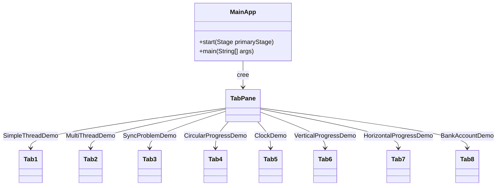
```mermaid
classDiagram
    class MainApp {
        +start(Stage primaryStage)
        +main(String[] args)
    }
    
    MainApp --> TabPane : cree
    TabPane --> Tab1 : SimpleThreadDemo
    TabPane --> Tab2 : MultiThreadDemo
    TabPane --> Tab3 : SyncProblemDemo
    TabPane --> Tab4 : CircularProgressDemo
    TabPane --> Tab5 : ClockDemo
    TabPane --> Tab6 : VerticalProgressDemo
    TabPane --> Tab7 : HorizontalProgressDemo
    TabPane --> Tab8 : BankAccountDemo
```

### Fonctionnement

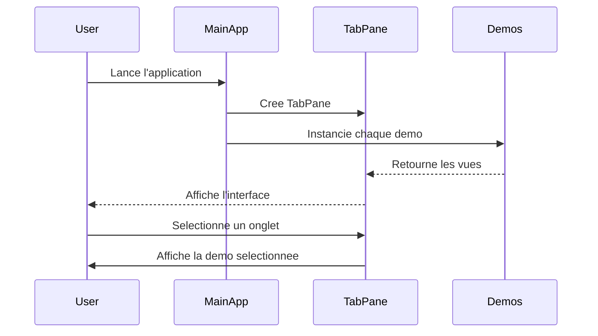
```mermaid
sequenceDiagram
    participant User
    participant MainApp
    participant TabPane
    participant Demos
    
    User->>MainApp: Lance l'application
    MainApp->>TabPane: Cree TabPane
    MainApp->>Demos: Instancie chaque demo
    Demos-->>TabPane: Retourne les vues
    TabPane-->>User: Affiche l'interface
    User->>TabPane: Selectionne un onglet
    TabPane->>User: Affiche la demo selectionnee
```

### Composants principaux

- **TabPane** : Conteneur d'onglets pour organiser les demonstrations
- **Scene** : Taille 1200x850 pixels pour un affichage optimal
- **Stage** : Fenetre principale avec titre pedagogique
- **Cleanup Handler** : Ferme proprement l'application

### Code cle

```java
// Creation des onglets pour chaque demonstration
Tab tab1 = new Tab("Lecon 1 : Premier Thread");
tab1.setContent(new SimpleThreadDemo().getView());

// Configuration de la scene
Scene scene = new Scene(tabPane, 1200, 850);
```

---

## Lecon 1 : SimpleThreadDemo.java

### Objectif pedagogique

Introduire le concept de thread en Java avec un exemple simple et visuel.

### Diagramme de structure

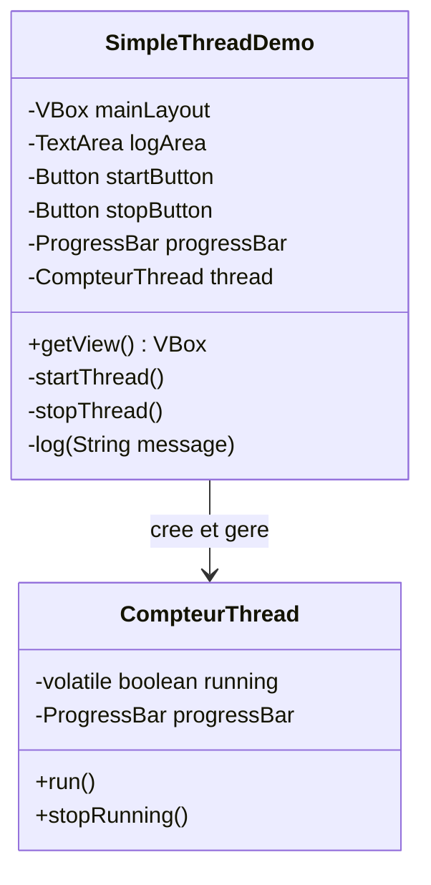
```mermaid
classDiagram
    class SimpleThreadDemo {
        -VBox mainLayout
        -TextArea logArea
        -Button startButton
        -Button stopButton
        -ProgressBar progressBar
        -CompteurThread thread
        +getView() VBox
        -startThread()
        -stopThread()
        -log(String message)
    }
    
    class CompteurThread {
        -volatile boolean running
        -ProgressBar progressBar
        +run()
        +stopRunning()
    }
    
    SimpleThreadDemo --> CompteurThread : cree et gere
```

### Flux d'execution

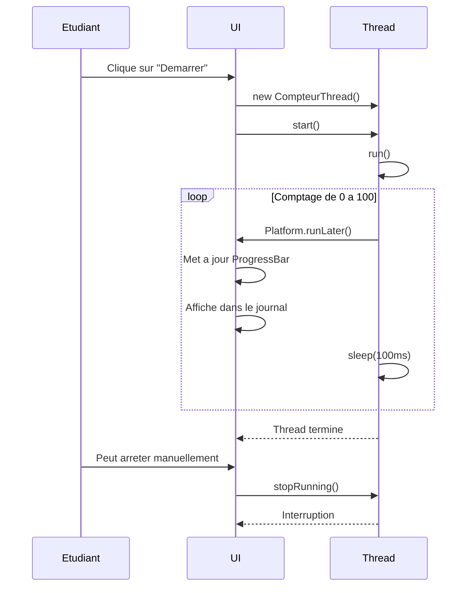
```mermaid
sequenceDiagram
    participant Etudiant
    participant UI
    participant Thread
    
    Etudiant->>UI: Clique sur "Demarrer"
    UI->>Thread: new CompteurThread()
    UI->>Thread: start()
    Thread->>Thread: run()
    loop Comptage de 0 a 100
        Thread->>UI: Platform.runLater()
        UI->>UI: Met a jour ProgressBar
        UI->>UI: Affiche dans le journal
        Thread->>Thread: sleep(100ms)
    end
    Thread-->>UI: Thread termine
    Etudiant->>UI: Peut arreter manuellement
    UI->>Thread: stopRunning()
    Thread-->>UI: Interruption
```

### Concepts enseignes

1. **Creation d'un thread** : Extends Thread ou implements Runnable
2. **Methode run()** : Point d'entree du thread
3. **start() vs run()** : Lancement dans un nouveau thread
4. **Platform.runLater()** : Mise a jour de l'UI depuis un thread
5. **volatile** : Visibilite des variables entre threads
6. **Thread.sleep()** : Pause dans l'execution
7. **interrupt()** : Arret propre d'un thread

### Elements d'interface

- **Titre** : Explique la lecon
- **Zone d'explication** : TextArea avec le concept
- **ProgressBar** : Visualisation de la progression (0-100%)
- **Boutons** : Demarrer et Arreter le thread
- **Journal d'execution** : TextArea montrant chaque etape

---

## Lecon 2 : MultiThreadDemo.java

### Objectif pedagogique

Demontrer l'execution parallele de plusieurs threads independants.

### Diagramme de structure

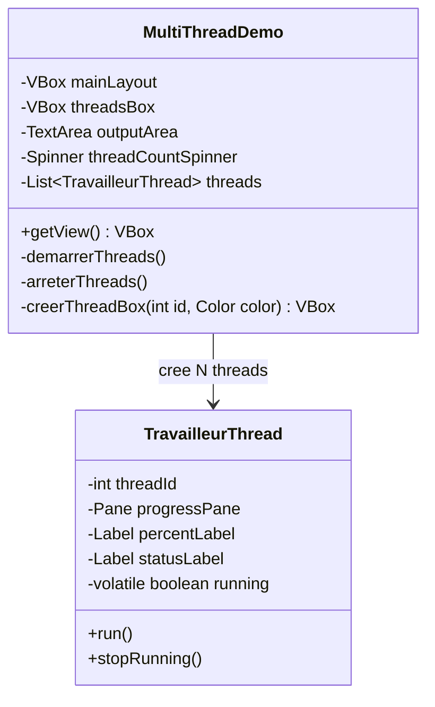
```mermaid
classDiagram
    class MultiThreadDemo {
        -VBox mainLayout
        -VBox threadsBox
        -TextArea outputArea
        -Spinner threadCountSpinner
        -List~TravailleurThread~ threads
        +getView() VBox
        -demarrerThreads()
        -arreterThreads()
        -creerThreadBox(int id, Color color) VBox
    }
    
    class TravailleurThread {
        -int threadId
        -Pane progressPane
        -Label percentLabel
        -Label statusLabel
        -volatile boolean running
        +run()
        +stopRunning()
    }
    
    MultiThreadDemo --> TravailleurThread : cree N threads
```

### Flux d'execution parallele

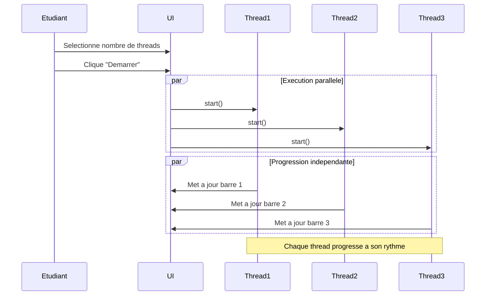
```mermaid
sequenceDiagram
    participant Etudiant
    participant UI
    participant Thread1
    participant Thread2
    participant Thread3
    
    Etudiant->>UI: Selectionne nombre de threads
    Etudiant->>UI: Clique "Demarrer"
    
    par Execution parallele
        UI->>Thread1: start()
        UI->>Thread2: start()
        UI->>Thread3: start()
    end
    
    par Progression independante
        Thread1->>UI: Met a jour barre 1
        Thread2->>UI: Met a jour barre 2
        Thread3->>UI: Met a jour barre 3
    end
    
    Note over Thread1,Thread3: Chaque thread progresse a son rythme
```

### Barres de progression visuelles

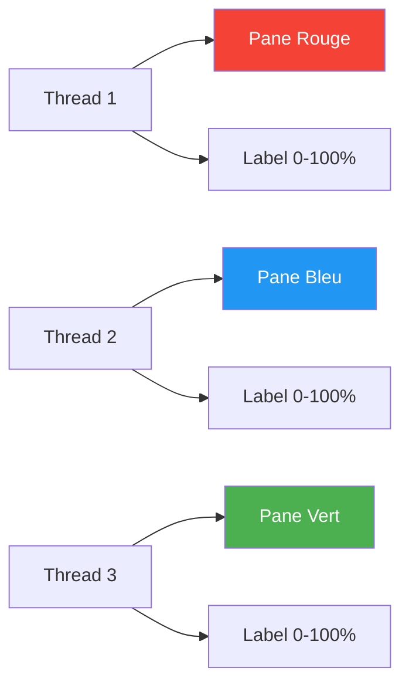
```mermaid
graph LR
    A[Thread 1] --> B[Pane Rouge]
    A --> C[Label 0-100%]
    D[Thread 2] --> E[Pane Bleu]
    D --> F[Label 0-100%]
    G[Thread 3] --> H[Pane Vert]
    G --> I[Label 0-100%]
    
    style B fill:#f44336,color:#fff
    style E fill:#2196F3,color:#fff
    style H fill:#4CAF50,color:#fff
```

### Concepts enseignes

1. **Parallelisme** : Plusieurs threads s'executent simultanement
2. **Independance** : Chaque thread a sa propre progression
3. **Gestion multiple** : Demarrer/Arreter plusieurs threads
4. **UI responsive** : Interface reste reactive pendant l'execution
5. **Spinner** : Selection dynamique du nombre de threads
6. **ScrollPane** : Gestion de nombreux threads
7. **Couleurs distinctes** : Identification visuelle des threads

### Elements d'interface

- **Spinner** : Choix de 1 a 10 threads
- **Zone de threads** : ScrollPane avec barres visuelles
- **Barres colorees** : Rouge, Bleu, Vert, Orange, Violet, etc.
- **Pourcentages** : Labels superposes aux barres
- **Statuts** : En cours / Termine pour chaque thread
- **Journal** : Historique des evenements

---

## Lecon 3 : SyncProblemDemo.java

### Objectif pedagogique

Demontrer le probleme de race condition et l'importance de la synchronisation.

### Diagramme de structure

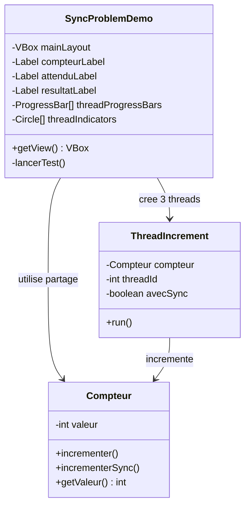
```mermaid
classDiagram
    class SyncProblemDemo {
        -VBox mainLayout
        -Label compteurLabel
        -Label attenduLabel
        -Label resultatLabel
        -ProgressBar[] threadProgressBars
        -Circle[] threadIndicators
        +getView() VBox
        -lancerTest()
    }
    
    class Compteur {
        -int valeur
        +incrementer()
        +incrementerSync()
        +getValeur() int
    }
    
    class ThreadIncrement {
        -Compteur compteur
        -int threadId
        -boolean avecSync
        +run()
    }
    
    SyncProblemDemo --> Compteur : utilise partage
    SyncProblemDemo --> ThreadIncrement : cree 3 threads
    ThreadIncrement --> Compteur : incremente
```

### Scenario sans synchronisation (PROBLEME)

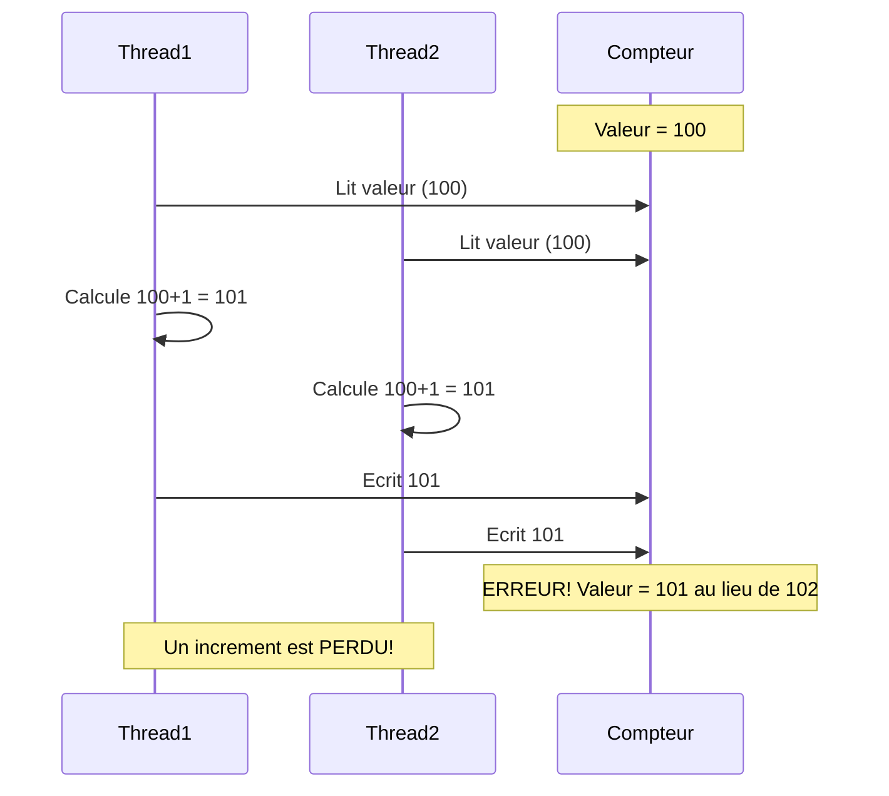
```mermaid
sequenceDiagram
    participant Thread1
    participant Thread2
    participant Compteur
    
    Note over Compteur: Valeur = 100
    
    Thread1->>Compteur: Lit valeur (100)
    Thread2->>Compteur: Lit valeur (100)
    Thread1->>Thread1: Calcule 100+1 = 101
    Thread2->>Thread2: Calcule 100+1 = 101
    Thread1->>Compteur: Ecrit 101
    Thread2->>Compteur: Ecrit 101
    
    Note over Compteur: ERREUR! Valeur = 101 au lieu de 102
    Note over Thread1,Thread2: Un increment est PERDU!
```

### Scenario avec synchronisation (SOLUTION)

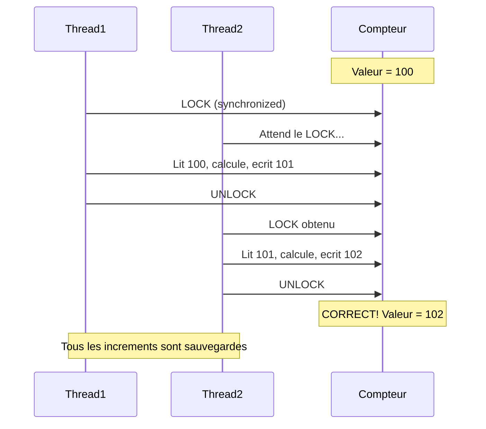
```mermaid
sequenceDiagram
    participant Thread1
    participant Thread2
    participant Compteur
    
    Note over Compteur: Valeur = 100
    
    Thread1->>Compteur: LOCK (synchronized)
    Thread2->>Compteur: Attend le LOCK...
    Thread1->>Compteur: Lit 100, calcule, ecrit 101
    Thread1->>Compteur: UNLOCK
    Thread2->>Compteur: LOCK obtenu
    Thread2->>Compteur: Lit 101, calcule, ecrit 102
    Thread2->>Compteur: UNLOCK
    
    Note over Compteur: CORRECT! Valeur = 102
    Note over Thread1,Thread2: Tous les increments sont sauvegardes
```

### Race condition expliquee

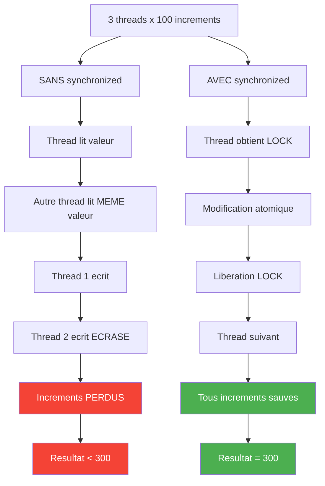
```mermaid
graph TB
    Start[3 threads x 100 increments]
    Start --> NoSync[SANS synchronized]
    Start --> WithSync[AVEC synchronized]
    
    NoSync --> Read1[Thread lit valeur]
    Read1 --> Read2[Autre thread lit MEME valeur]
    Read2 --> Write1[Thread 1 ecrit]
    Write1 --> Write2[Thread 2 ecrit ECRASE]
    Write2 --> Lost[Increments PERDUS]
    Lost --> Result1[Resultat < 300]
    
    WithSync --> Lock[Thread obtient LOCK]
    Lock --> Modify[Modification atomique]
    Modify --> Unlock[Liberation LOCK]
    Unlock --> Next[Thread suivant]
    Next --> Correct[Tous increments sauves]
    Correct --> Result2[Resultat = 300]
    
    style Lost fill:#f44336,color:#fff
    style Result1 fill:#f44336,color:#fff
    style Correct fill:#4CAF50,color:#fff
    style Result2 fill:#4CAF50,color:#fff
```

### Concepts enseignes

1. **Race condition** : Plusieurs threads modifient la meme donnee
2. **Perte de donnees** : Increments ecrases sans synchronisation
3. **synchronized** : Mot-cle pour proteger les sections critiques
4. **Section critique** : Code acces aux ressources partagees
5. **Atomicite** : Operation indivisible avec synchronized
6. **Verrou (Lock)** : Mecanisme d'exclusion mutuelle
7. **Resultats deterministes** : Garantis avec synchronisation

### Elements d'interface

- **Compteur central** : Affichage en temps reel
- **Valeur attendue** : 300 (3 threads x 100)
- **3 barres de progression** : Une par thread
- **3 indicateurs colorés** : Statut de chaque thread
- **Boutons de test** : SANS vs AVEC synchronisation
- **Resultat visuel** : Rouge (echec) ou Vert (succes)
- **Animation** : 3ms entre increments pour voir la contention

---

## Lecon 4 : BankAccountDemo.java

### Objectif pedagogique

Illustrer un cas reel de race condition avec un exemple de compte bancaire.

### Diagramme de structure

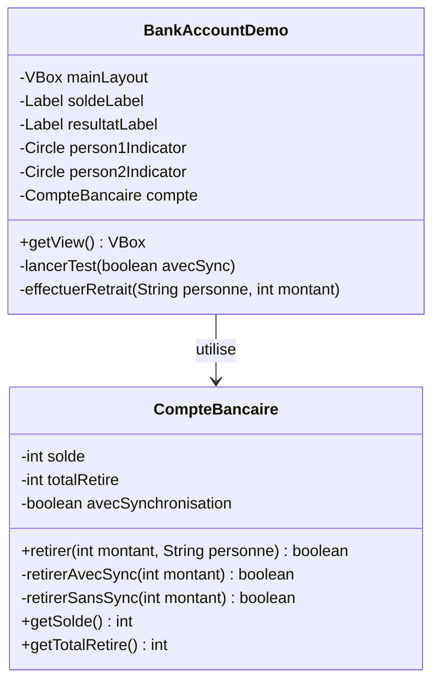
```mermaid
classDiagram
    class BankAccountDemo {
        -VBox mainLayout
        -Label soldeLabel
        -Label resultatLabel
        -Circle person1Indicator
        -Circle person2Indicator
        -CompteBancaire compte
        +getView() VBox
        -lancerTest(boolean avecSync)
        -effectuerRetrait(String personne, int montant)
    }
    
    class CompteBancaire {
        -int solde
        -int totalRetire
        -boolean avecSynchronisation
        +retirer(int montant, String personne) boolean
        -retirerAvecSync(int montant) boolean
        -retirerSansSync(int montant) boolean
        +getSolde() int
        +getTotalRetire() int
    }
    
    BankAccountDemo --> CompteBancaire : utilise
```

### Scenario du hack bancaire (SANS synchronisation)

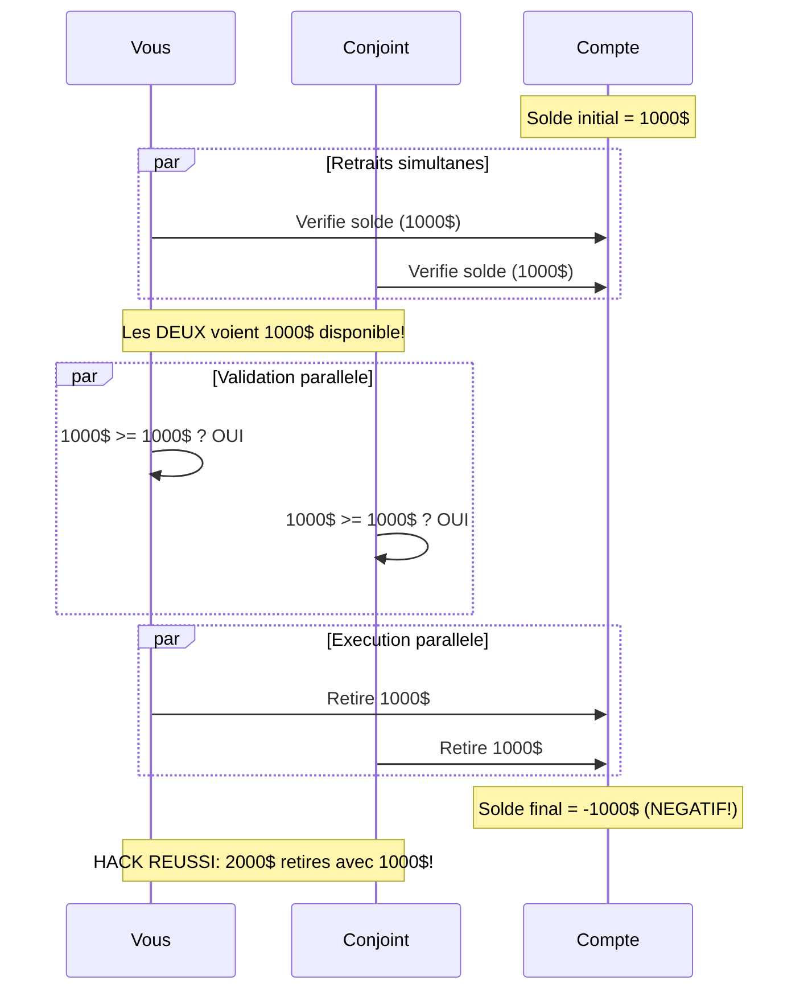
```mermaid
sequenceDiagram
    participant Vous
    participant Conjoint
    participant Compte
    
    Note over Compte: Solde initial = 1000$
    
    par Retraits simultanes
        Vous->>Compte: Verifie solde (1000$)
        Conjoint->>Compte: Verifie solde (1000$)
    end
    
    Note over Vous,Conjoint: Les DEUX voient 1000$ disponible!
    
    par Validation parallele
        Vous->>Vous: 1000$ >= 1000$ ? OUI
        Conjoint->>Conjoint: 1000$ >= 1000$ ? OUI
    end
    
    par Execution parallele
        Vous->>Compte: Retire 1000$
        Conjoint->>Compte: Retire 1000$
    end
    
    Note over Compte: Solde final = -1000$ (NEGATIF!)
    Note over Vous,Conjoint: HACK REUSSI: 2000$ retires avec 1000$!
```

### Scenario securise (AVEC synchronisation)

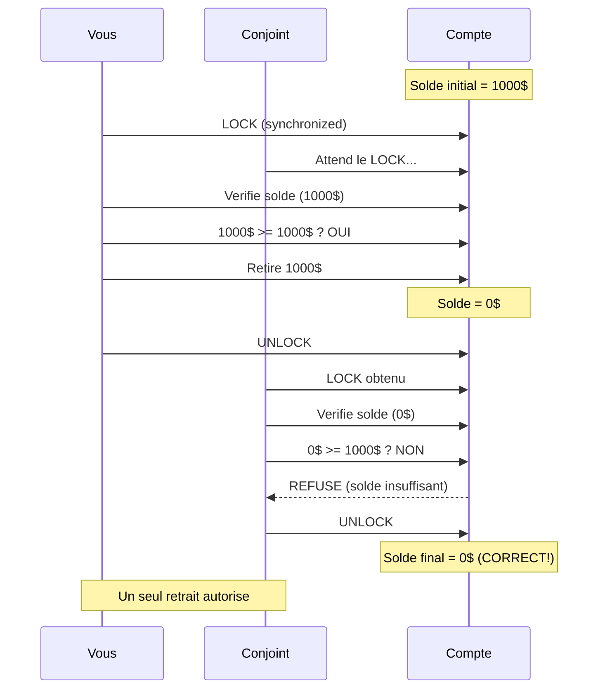
```mermaid
sequenceDiagram
    participant Vous
    participant Conjoint
    participant Compte
    
    Note over Compte: Solde initial = 1000$
    
    Vous->>Compte: LOCK (synchronized)
    Conjoint->>Compte: Attend le LOCK...
    Vous->>Compte: Verifie solde (1000$)
    Vous->>Compte: 1000$ >= 1000$ ? OUI
    Vous->>Compte: Retire 1000$
    Note over Compte: Solde = 0$
    Vous->>Compte: UNLOCK
    
    Conjoint->>Compte: LOCK obtenu
    Conjoint->>Compte: Verifie solde (0$)
    Conjoint->>Compte: 0$ >= 1000$ ? NON
    Compte-->>Conjoint: REFUSE (solde insuffisant)
    Conjoint->>Compte: UNLOCK
    
    Note over Compte: Solde final = 0$ (CORRECT!)
    Note over Vous,Conjoint: Un seul retrait autorise
```

### Etats du compte bancaire

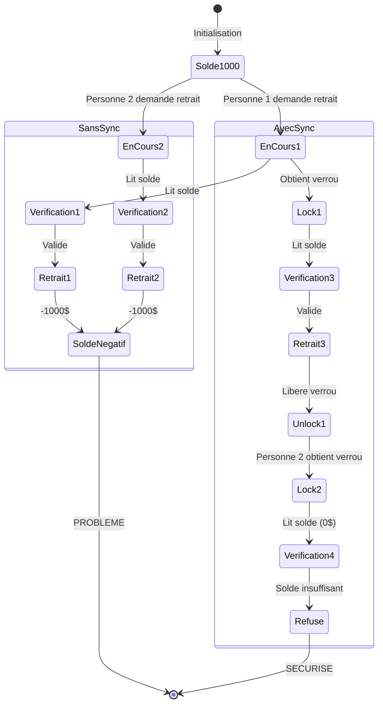
```mermaid
stateDiagram-v2
    [*] --> Solde1000: Initialisation
    
    Solde1000 --> EnCours1: Personne 1 demande retrait
    Solde1000 --> EnCours2: Personne 2 demande retrait
    
    state SansSync {
        EnCours1 --> Verification1: Lit solde
        EnCours2 --> Verification2: Lit solde
        Verification1 --> Retrait1: Valide
        Verification2 --> Retrait2: Valide
        Retrait1 --> SoldeNegatif: -1000$
        Retrait2 --> SoldeNegatif: -1000$
    }
    
    state AvecSync {
        EnCours1 --> Lock1: Obtient verrou
        Lock1 --> Verification3: Lit solde
        Verification3 --> Retrait3: Valide
        Retrait3 --> Unlock1: Libere verrou
        Unlock1 --> Lock2: Personne 2 obtient verrou
        Lock2 --> Verification4: Lit solde (0$)
        Verification4 --> Refuse: Solde insuffisant
    }
    
    SoldeNegatif --> [*]: PROBLEME
    Refuse --> [*]: SECURISE
```

### Concepts enseignes

1. **Cas reel** : Scenario de double retrait bancaire
2. **Vulnerabilite** : Faille de securite sans synchronisation
3. **Protection** : Synchronized protege les transactions
4. **Atomicite** : Verification + retrait indivisibles
5. **Check-Then-Act** : Pattern dangereux sans synchronisation
6. **Race condition** : Deux clients acces simultane
7. **Secteur critique** : Methode de retrait doit etre protegee

### Elements d'interface

- **Solde central** : Affichage dynamique avec couleur
- **Deux personnes** : Vous et votre conjoint(e)
- **Indicateurs** : Gris (attente), Orange (traitement), Vert/Rouge (resultat)
- **Boutons de test** : SANS vs AVEC synchronisation
- **Resultat dramatique** : Alerte rouge si hack reussi
- **Journal detaille** : Chaque etape du processus
- **ScrollPane** : Contenu scrollable si necessaire

---

## Demo : CircularProgressDemo.java

### Objectif

Demonstration visuelle de barres de progression circulaires animees.

### Diagramme de structure

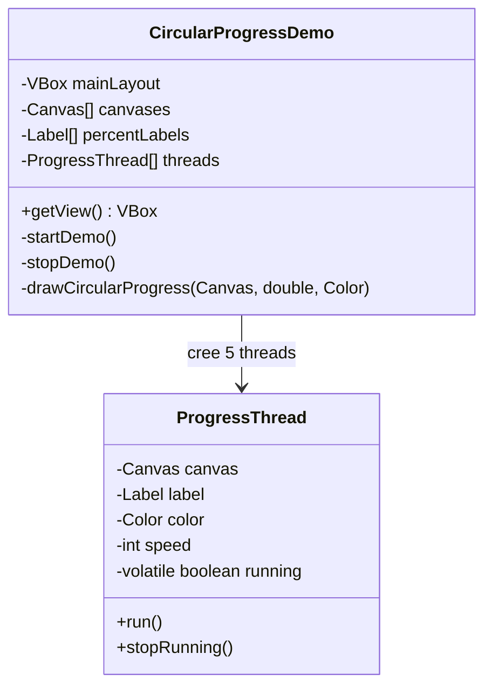
```mermaid
classDiagram
    class CircularProgressDemo {
        -VBox mainLayout
        -Canvas[] canvases
        -Label[] percentLabels
        -ProgressThread[] threads
        +getView() VBox
        -startDemo()
        -stopDemo()
        -drawCircularProgress(Canvas, double, Color)
    }
    
    class ProgressThread {
        -Canvas canvas
        -Label label
        -Color color
        -int speed
        -volatile boolean running
        +run()
        +stopRunning()
    }
    
    CircularProgressDemo --> ProgressThread : cree 5 threads
```

### Rendu visuel des cercles

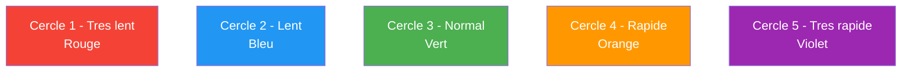
```mermaid
graph TB
    C1[Cercle 1 - Tres lent<br/>Rouge]
    C2[Cercle 2 - Lent<br/>Bleu]
    C3[Cercle 3 - Normal<br/>Vert]
    C4[Cercle 4 - Rapide<br/>Orange]
    C5[Cercle 5 - Tres rapide<br/>Violet]
    
    style C1 fill:#f44336,color:#fff
    style C2 fill:#2196F3,color:#fff
    style C3 fill:#4CAF50,color:#fff
    style C4 fill:#FF9800,color:#fff
    style C5 fill:#9C27B0,color:#fff
```

### Algorithme de dessin

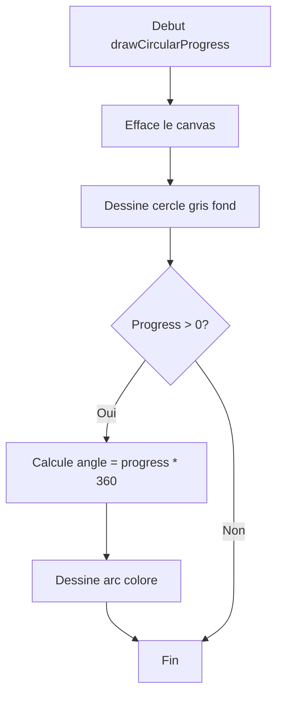
```mermaid
flowchart TD
    Start[Debut drawCircularProgress]
    Start --> Clear[Efface le canvas]
    Clear --> BG[Dessine cercle gris fond]
    BG --> Check{Progress > 0?}
    Check -->|Oui| Calc[Calcule angle = progress * 360]
    Calc --> Arc[Dessine arc colore]
    Arc --> End[Fin]
    Check -->|Non| End
```

### Elements d'interface

- **5 Canvas** : Zones de dessin 200x200 pixels
- **Arcs colores** : Progression de 0 a 360 degres
- **Pourcentages** : Labels superposes au centre
- **Vitesses differentes** : 5 threads avec delays variables
- **Boutons** : Demarrer et Reinitialiser
- **Layout** : HBox avec espacement de 40px

---

## Demo : ClockDemo.java

### Objectif

Demonstration de trois horloges analogiques synchronisees.

### Diagramme de structure

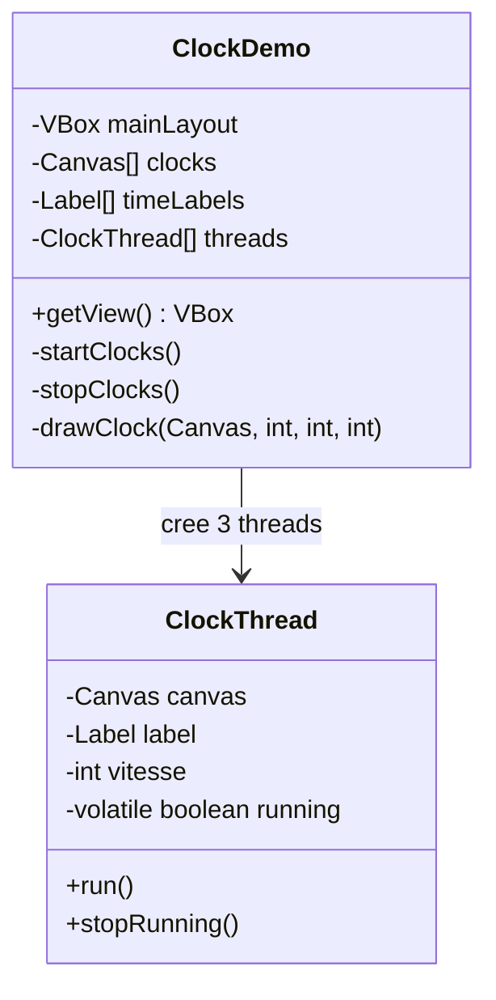
```mermaid
classDiagram
    class ClockDemo {
        -VBox mainLayout
        -Canvas[] clocks
        -Label[] timeLabels
        -ClockThread[] threads
        +getView() VBox
        -startClocks()
        -stopClocks()
        -drawClock(Canvas, int, int, int)
    }
    
    class ClockThread {
        -Canvas canvas
        -Label label
        -int vitesse
        -volatile boolean running
        +run()
        +stopRunning()
    }
    
    ClockDemo --> ClockThread : cree 3 threads
```

### Dessin d'une horloge

```mermaid
graph TD
    A[Canvas 250x250] --> B[Cercle exterieur]
    B --> C[Marques des heures]
    C --> D[Aiguille des heures]
    D --> E[Aiguille des minutes]
    E --> F[Aiguille des secondes]
    F --> G[Point central]
    
    style A fill:#e3f2fd
    style G fill:#000
```

### Calcul des angles

```
Angle Heures = (heures % 12) * 30 + minutes * 0.5
Angle Minutes = minutes * 6 + secondes * 0.1
Angle Secondes = secondes * 6

Longueur Heures = rayon * 0.5
Longueur Minutes = rayon * 0.7
Longueur Secondes = rayon * 0.85
```

### Elements d'interface

- **3 Horloges** : Vitesse normale, 2x, 5x
- **Affichage numerique** : HH:MM:SS sous chaque horloge
- **Synchronisation** : Toutes partent de 12:00:00
- **Aiguilles** : Heures (epaisse), Minutes (moyenne), Secondes (fine)
- **Couleurs** : Noir pour les aiguilles, rouge pour les secondes
- **Boutons** : Demarrer et Arreter

---

## Demo : VerticalProgressDemo.java

### Objectif

Demonstration de barres de progression verticales.

### Diagramme de structure

```mermaid
classDiagram
    class VerticalProgressDemo {
        -VBox mainLayout
        -ProgressBar bar1, bar2, bar3
        -Label label1, label2, label3
        -WorkerThread thread1, thread2, thread3
        +getView() VBox
        -startThreads()
        -stopThreads()
        -createVerticalBar(String, Color) VBox
    }
    
    class WorkerThread {
        -ProgressBar progressBar
        -Label label
        -int delay
        -volatile boolean running
        +run()
        +stopRunning()
    }
    
    VerticalProgressDemo --> WorkerThread : cree 3 threads
```

### Rotation des barres

```mermaid
graph LR
    A[ProgressBar horizontale<br/>530x80px] -->|Rotation -90deg| B[Barre verticale<br/>80x530px]
    B --> C[StackPane<br/>90x550px]
    C --> D[Affichage vertical]
    
    style A fill:#2196F3,color:#fff
    style D fill:#4CAF50,color:#fff
```

### Vitesses des threads

```
Thread 1 (Rouge)    : delay = 150ms (Lent)
Thread 2 (Bleu)     : delay = 80ms  (Moyen)
Thread 3 (Vert)     : delay = 40ms  (Rapide)

Progression : +2% toutes les delay ms
Duree totale : 50 iterations
```

### Elements d'interface

- **3 Barres verticales** : 530px de haut, 80px de large
- **Labels du haut** : Nom et vitesse de chaque thread
- **Labels du bas** : Pourcentage 0-100%
- **Couleurs** : Rouge (lent), Bleu (moyen), Vert (rapide)
- **ScrollPane** : Contenu scrollable
- **Journal** : Messages de progression

---

## Demo : HorizontalProgressDemo.java

### Objectif

Demonstration de barres de progression horizontales classiques.

### Diagramme de structure

```mermaid
classDiagram
    class HorizontalProgressDemo {
        -VBox mainLayout
        -ProgressBar bar1, bar2, bar3
        -Label label1, label2, label3
        -WorkerThread thread1, thread2, thread3
        +getView() VBox
        -startThreads()
        -stopThreads()
        -createHorizontalBar(String, Color) VBox
    }
    
    class WorkerThread {
        -ProgressBar progressBar
        -Label label
        -int delay
        -volatile boolean running
        +run()
        +stopRunning()
    }
    
    HorizontalProgressDemo --> WorkerThread : cree 3 threads
```

### Layout des barres

```mermaid
graph TD
    A[VBox principale] --> B[Barre 1 - Rouge - Lent]
    A --> C[Barre 2 - Bleu - Moyen]
    A --> D[Barre 3 - Vert - Rapide]
    
    B --> E[Label nom]
    B --> F[ProgressBar 800x50]
    B --> G[Label pourcentage]
    
    style B fill:#f44336,color:#fff
    style C fill:#2196F3,color:#fff
    style D fill:#4CAF50,color:#fff
```

### Elements d'interface

- **3 Barres horizontales** : 800px de large, 50px de haut
- **Layout vertical** : Empilees les unes sur les autres
- **Progression independante** : Chaque thread a sa vitesse
- **Couleurs CSS** : Utilise -fx-accent pour colorer
- **Labels integres** : Nom, barre, pourcentage
- **Boutons** : Demarrer et Reinitialiser

---

## CONCEPTS JAVA AVANCES UTILISES

### 1. Threads en Java

```java
// Methode 1 : Extends Thread
class MonThread extends Thread {
    public void run() {
        // Code execute dans le thread
    }
}

// Methode 2 : Implements Runnable
class MonRunnable implements Runnable {
    public void run() {
        // Code execute dans le thread
    }
}

// Demarrage
Thread t = new MonThread();
t.start();  // Lance run() dans un nouveau thread
```

### 2. Synchronisation

```java
// Mot-cle synchronized sur methode
public synchronized void methodeProtegee() {
    // Section critique - un seul thread a la fois
}

// Bloc synchronized
synchronized(objetVerrou) {
    // Section critique protegee par objetVerrou
}
```

### 3. Platform.runLater()

```java
// Mise a jour de l'UI depuis un thread non-JavaFX
Platform.runLater(() -> {
    label.setText("Nouveau texte");
    progressBar.setProgress(0.5);
});
```

### 4. Volatile

```java
// Variable visible par tous les threads
private volatile boolean running = true;

// Thread 1
running = false;

// Thread 2 voit immediatement le changement
while(running) { ... }
```

### 5. Thread.sleep()

```java
try {
    Thread.sleep(1000);  // Pause 1 seconde
} catch (InterruptedException e) {
    // Thread interrompu
}
```

### 6. Interrupt

```java
// Arreter proprement un thread
thread.interrupt();

// Dans le thread
if (Thread.interrupted()) {
    return;  // Sortie propre
}
```

---

## PATTERNS DE CONCEPTION UTILISES

### 1. Observer Pattern (implicite avec JavaFX)

L'interface JavaFX observe les changements et met a jour automatiquement.

### 2. Worker Thread Pattern

Les WorkerThread effectuent des taches longues sans bloquer l'UI.

### 3. Singleton Pattern (CompteBancaire)

Un seul compte partage entre plusieurs threads.

### 4. Template Method Pattern

Les classes de demo suivent une structure commune : 
- constructeur initialise l'UI
- methodes start/stop gerent les threads
- getView() retourne la vue

---

## UTILISATION PEDAGOGIQUE

### Ordre recommande d'enseignement

```mermaid
graph TD
    A[Lecon 1: SimpleThreadDemo] --> B[Lecon 2: MultiThreadDemo]
    B --> C[Lecon 3: SyncProblemDemo]
    C --> D[Lecon 4: BankAccountDemo]
    
    B --> E[Demo: CircularProgressDemo]
    B --> F[Demo: ClockDemo]
    B --> G[Demo: VerticalProgressDemo]
    B --> H[Demo: HorizontalProgressDemo]
    
    style A fill:#4CAF50,color:#fff
    style B fill:#4CAF50,color:#fff
    style C fill:#f44336,color:#fff
    style D fill:#f44336,color:#fff
```

### Points cles a expliquer

1. **Parallelisme** : Les threads s'executent vraiment en meme temps
2. **Independance** : Chaque thread a sa propre pile d'execution
3. **Partage memoire** : Les threads partagent le tas (heap)
4. **Race condition** : Danger quand plusieurs threads modifient la meme donnee
5. **Synchronisation** : Solution avec synchronized
6. **Performance** : Cout de la synchronisation vs securite
7. **Deadlock** : Risque si mauvaise utilisation de synchronized

### Exercices suggeres

1. Modifier les vitesses des threads
2. Ajouter plus de threads dans MultiThreadDemo
3. Creer un compteur avec 10 threads au lieu de 3
4. Tester le compte bancaire avec 3 personnes
5. Implementer un nouveau type de barre de progression
6. Creer une horloge avec fuseau horaire different

---

## COMPILATION ET EXECUTION

### Compilation Maven

```bash
mvn clean compile
```

### Execution

```bash
mvn javafx:run
```

### Creation d'un JAR executable

```bash
mvn clean package
java -jar target/threadsdemo1-1.0-SNAPSHOT.jar
```

---

## PREREQUIS TECHNIQUES

### Logiciels requis

- Java JDK 17 ou superieur
- Apache Maven 3.6 ou superieur
- JavaFX 21 (gere automatiquement par Maven)

### Connaissances prerequises

- Bases de Java (classes, methodes, heritage)
- Notion de POO
- Bases d'interface graphique (optionnel)

### Concepts a maitriser apres

- Creation et gestion de threads
- Synchronisation inter-threads
- Race conditions et solutions
- Interface JavaFX reactive
- Platform.runLater()
- Volatile et visibilite memoire

---

## REFERENCES ET RESSOURCES

### Documentation Java

- Oracle Java Tutorials - Concurrency
- JavaFX Documentation officielle
- Java Thread API Documentation

### Livres recommandes

- "Java Concurrency in Practice" - Brian Goetz
- "Effective Java" - Joshua Bloch
- "Java: The Complete Reference" - Herbert Schildt

### Concepts avances a explorer

- ExecutorService et Thread Pools
- Locks et Conditions
- Atomic Variables
- CompletableFuture
- Parallel Streams
- Fork/Join Framework

---

## CONCLUSION

Ce guide presente une suite complete de demonstrations pedagogiques pour enseigner les threads en Java avec JavaFX. Chaque demonstration est autonome mais suit une progression logique du simple au complexe.

L'approche visuelle permet aux etudiants de voir concretement les concepts abstraits de parallelisme et de synchronisation. Les cas reels (compte bancaire) rendent l'apprentissage plus concret et memorable.

L'ensemble du code est structure de maniere claire et commentee pour faciliter la comprehension et la modification par les etudiants.

